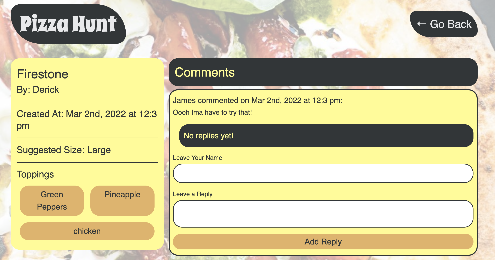

# Pizza-Hunt
Share your love of pizza with this social media web application based on MongoDB framework

## Table of Contents

- [Background](#background)
- [Installation](#installation)
- [Usage](#usage)
- [License](#license)
- [Challenges](#contributions)
- [Technologies](#technologies)
- [Credits](#credits)
- [Questions](#questions)

## Background

Pizza Hunt is a web application that uses an unstructured NoSQL database to create a thriving online community on behalf of a fictional pizza company. Users interacting with the website are able to create pizzas, post their pizzas, comment on other people's pizza choices/styles, and leave replies to other people's comments.

## Installation

Firstly install the NoSql database mongoDB on to your machine.   
Windows guide: https://www.mongodb.com/try/download/community  
Mac guide: https://docs.mongodb.com/manual/tutorial/install-mongodb-on-os-x/

Use "npm install" to install required modules for this application. Two notable packages for this project were mongoose as the document object mapper, and express.js for serving CRUD operations. In server.js file mongoose.connect will look for a database if it does not exist or create one for you. You're welcome to change the local MongoDB's server short-circuit as you see fit.

## Usage

This project highlights a genuine full-stack application MVP with offline capabilities.

Navigate through the tabs to learn more about how it works. Create your favorite pizza recipes, and scale the users as much as you want!

## License

This project is licensed under the MIT license.

## Challenges

Challenges included offline functionality, and ensuring objects created (in this case pizzas) would persist in the indexedDB. I simulated "going offline" by throttling the network for testing purposes. Outside of this just making sure the whole stack synced in terms of expectations was also a fun challenge!

## Technologies

Created with Express.js, MongoDB, bootstrap, Javascript, Mongoose, Insomnia, and Node.js etc.

## Credits

Created by Nahom Assefa

## Questions

Post an issue for suggested improvement.
